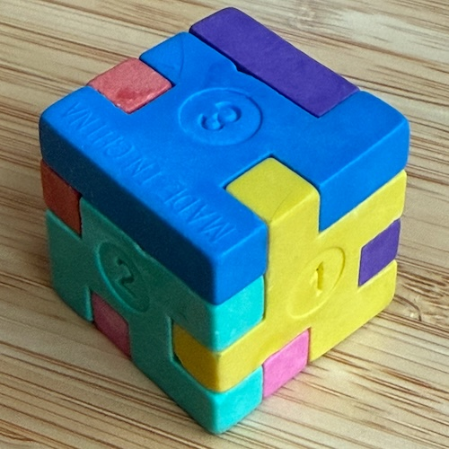
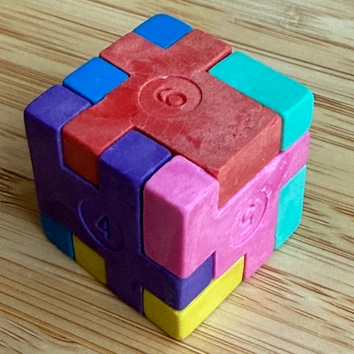
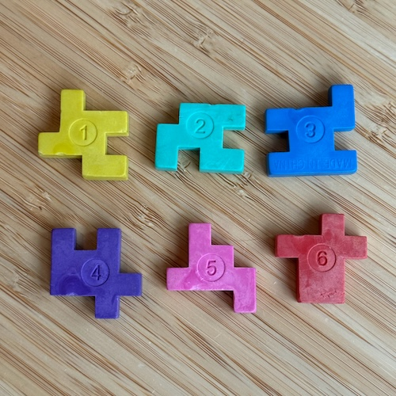

# CubePuzzle

A brute-force cube puzzle solver written in Java.

## The Puzzle

  

## Overview

The physical puzzle consists of 6 square pieces, each with a notched/bumpy contour. The goal is to assemble all 6 pieces onto the faces of a cube so that every shared edge between adjacent faces interlocks correctly — dents must meet protrusions and vice versa.

Each piece's contour is encoded as a 12-bit integer (one bit per half-edge segment), and the solver finds all valid arrangements.

## How It Works

1. **Encoding** — Each puzzle piece is represented as a 12-bit integer. For any given rotation (0°, 90°, 180°, 270°), the 4-bit value of each of its four edges can be computed.
2. **Pre-processing** — For every piece and rotation, each edge's bit value is indexed in a `HashMap<edgeBits → List<PieceEdge>>` to enable fast lookup of compatible pieces.
3. **DFS solving** — Faces of the cube (F0–F5) are filled one at a time. At each step, only pieces whose edges interlock with already-placed neighbors are considered (using the pre-built index). Additional edge constraints are verified as more faces are placed.
4. **Output** — Every valid complete assignment is printed as `F0 -> (P2, 90°), F1 -> (P5, 0°), ...` (face → piece number and rotation).

## Project Structure

| File | Description |
|---|---|
| `CubePuzzle.java` | Entry point — defines the 6 puzzle pieces and runs the solver |
| `Cube.java` | Core DFS solver with edge-matching lookup |
| `PuzzlePiece.java` | Holds a piece's 12-bit contour; computes edge values for any rotation |
| `OrientedPiece.java` | Pairs a piece index with a rotation |
| `PieceEdge.java` | Pairs a piece index with an edge direction |
| `FacetEdge.java` | Describes which two cube facets share an edge |
| `Node.java` | DFS stack node — holds a facet index and its assigned oriented piece |
| `PuzzleSolution.java` | Stores and prints a complete solution |

## Running

This is a plain Java project with no external dependencies. Compile and run with:

```bash
javac *.java
java CubePuzzle
```

Requires Java 8 or later.
